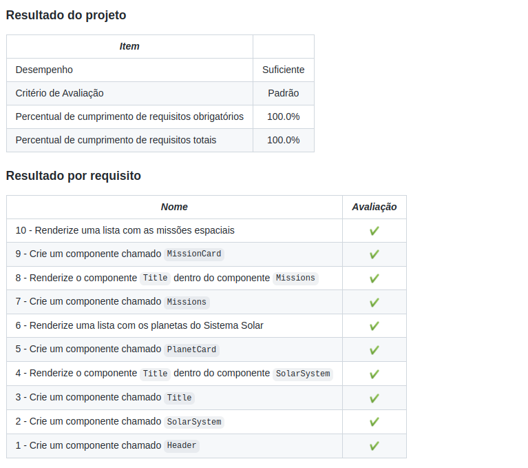

<h1>Sobre</h1>

Primeiro projeto do módulo 1 - Front-end, da <a href="https://betrybe.com" target="_blank">Trybe!</a>

Como primeiro desafio, tivemos que desenvolver uma aplicação em React com criação de componentes de classe e passagem de props. Essa aplicação simula uma visualização do Sistema Solar com informações sobre diversas missões espaciais que ocorreram ao longo da história.

obs: As imagens dos planetas e as informações das missões são fornecidas no projeto.

<h1>Instalando</h1>

Para instalar o projeto, basta executar o comando <code>npm install</code> no diretório raiz do projeto.

Logo depois execute o comando <code>npm start</code>

<h1>Tecnologias utilizadas</h1>

<ul>
  <li>React</li>
  <li>JavaScript</li>
</ul>

<h1>Nota</h1>

